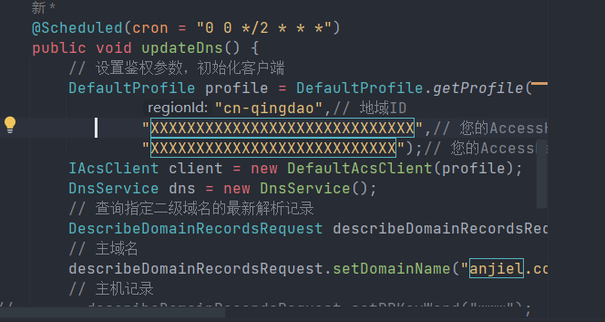

# 阿里云动态域名自动解析
> 将阿里云域名根据本地获取的的静态IP进行自动的解析， 通过定时任务自动控制，同时生成WINDOWS服务


1. 下载WINSW工具,winsw.exe 
**https://github.com/winsw/winsw/releases**
2. 编写配置文件 aliyun-dns.xml
```xml
    <service>
    <id>aliyun-dns</id>
    <name>aliyun-dns</name>
    <description>动态刷新阿里云dns解析</description>
    <!-- java环境变量 -->
    <env name="JAVA_HOME" value="%JAVA_HOME%"/>
    <executable>java</executable>
    <arguments>-jar aliyun-dns.jar"</arguments>
    <!-- 开机启动 -->
    <startmode>Automatic</startmode>
    <!-- 日志配置 -->
    <logpath>%BASE%\log</logpath>
    <logmode>rotate</logmode>
</service>
```
3. 将所有的文件命名成一个名字，后缀名不同，并且放在同一个目录下，参见项目中的build目录
4. 执行其中的一个exe文件，如下
```shell
aliyun-dns.exe install 
```
需要将下图中的XXX修改为自己对应的key，aliyun上的申请
